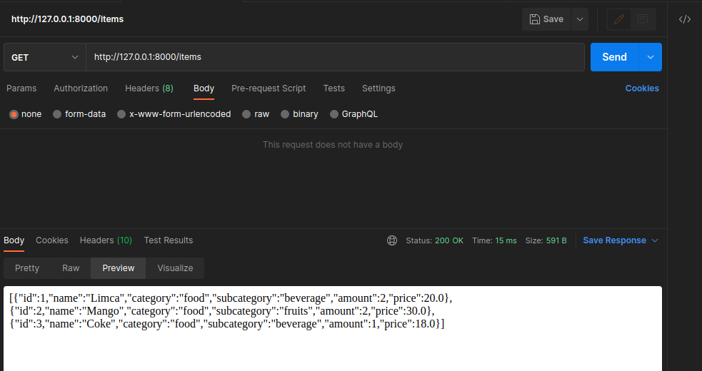
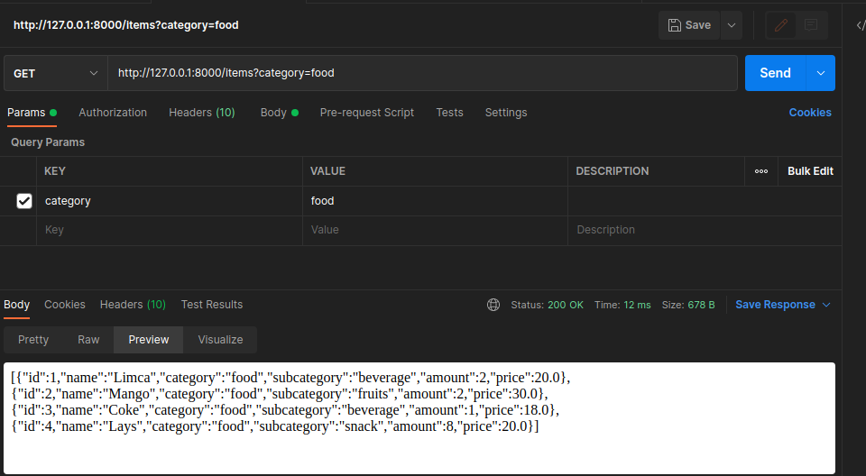
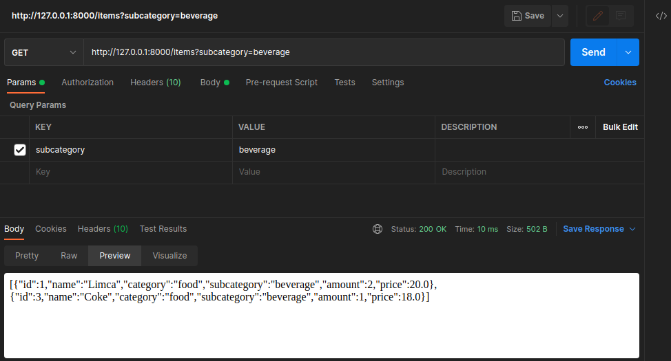
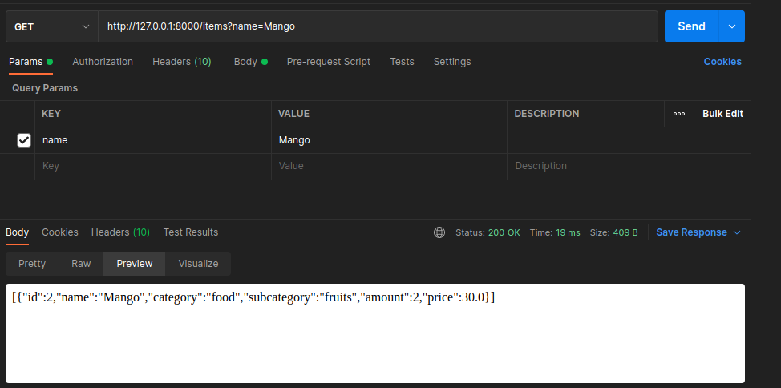
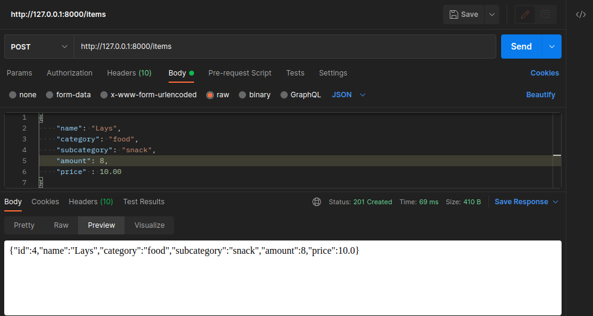
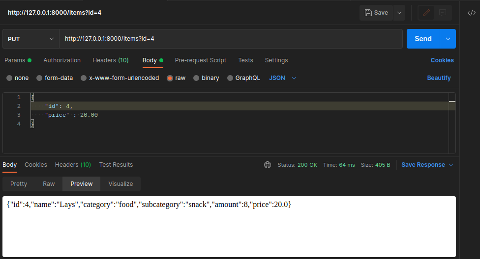

# Supermarket Billing Api
## How to use:

### 1. Get all items:
    Make a get request to /items
  

### 2. Get items by category:
    Make a get request to /items?category=category_name
  

### 3. Get items by subcategory:
    Make a get request to /items?subcategory=subcategory_name
  

### 4. Get item  by name:
    Make a get request to /items?name=name_of_item
  

### 5. Add a new item:
    Make a post request to /items
    Pass a json object having appropriate name, category, subcategory, amount and price.
  

### 6. Update an item:
    Make a put request to /items?id=id_of_item_to_update
    Pass the values you want to update with their new values in form of a json object
  
